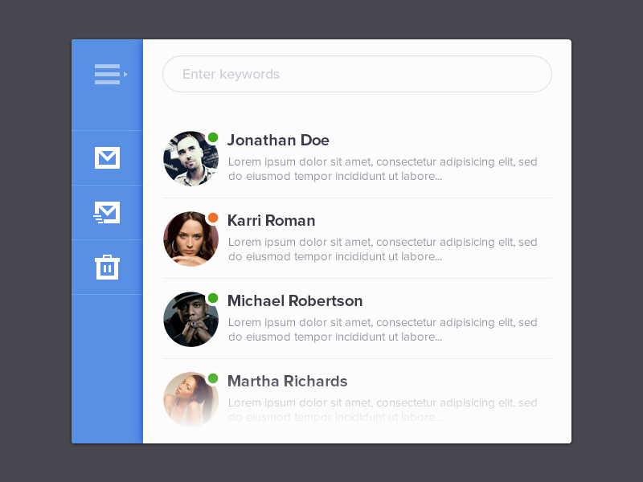

# react-lab

[](https://gitter.im/Charca/react-lab?utm_source=badge&utm_medium=badge&utm_campaign=pr-badge&utm_content=badge)
React and Flux training

> This is a very basic course that aims to gather some knowledge about the framework and how to quickly start using it.
> It's very bare-bones for now, so if you wish to contribute with links, examples, wording or pretty much anything, please open an issue or a PR in this repository. Thanks for reading!

## Table of Contents
1. [Introduction](#introduction)
2. [React and JSX](#react-and-jsx)
3. [Props and State](#props-and-state)
4. [Thinking in React](#thinking-in-react)
5. [Flux](#flux)
6. [Routing](#routing)
7. [Testing](#testing)
8. [React and ES6](#react-and-es6)
9. [Final Exercise](#final-exercise)

## Introduction

Welcome to the React Lab. This course was created to onboard developers into the world of building web applications with React and Flux. We'll cover everything from the basics of building React components, to creating full web applications using different tools and techniques.

Each chapter is composed of a series of links with documentation and examples for you to read, and it ends with a few exercises to apply the knowladge gathered in the process.

You can dedicate as much time as you want and go as deeply as needed into each one of the links.

### Prerequisites

You need to have at least a basic level of how the JavaScript language works. You don't need to have any experience with other frameworks or libraries, but it'd help if you've had some exposure to common JS design patterns and OOP.

In order to follow some of the tutorials, you'll need to have Node.js with NPM installed. If you don't have it already, check out the [Node.js website](https://nodejs.org/) for instructions on how to set up your enviroment for your OS.

### Support

We have a [Gitter chat room](https://gitter.im/Charca/react-lab) available if you need support, or you can contact any of the collaborators to the project.


## React and JSX

React is a JavaScript library built by Facebook and open sourced in 2013. Since then it gained a lot of popularity and it's now among the top JavaScript libraries (Backbone, Angular, Ember...). It's also being used in production both by Facebook and Instagram, among other large companies.

React is not a complete solution for building web applications, but it's really useful for building user interfaces, and it can be combined with frameworks like Backbone to provide a full experience on the web. It can be used to create simple components like buttons and form elements, or large and complex views to wrap your entire application.

React uses an optional syntax called JSX, that is a mix between XML and HTML, and it serves to define your components in a declarative way. It also provides transformers to compile JSX code to vanilla JavaScript so it can be interpreted by the browser.

A simple React component looks like this:

```javascript
var HelloMessage = React.createClass({
  render: function() {
    return <div>Hello, {this.props.name}</div>;
  }
});

React.render(
  <HelloMessage name="Maxi" />,
  document.getElementById('container')
);
```

This example will render a `<div>` with the message "Hello, Maxi" into a container on the page.

### Reading / watching material
- [[Docs] React Documentation index](http://facebook.github.io/react/) - Read about React and play around with the simple examples on the page. Also note the difference between the JSX version and the Compiled JS.
- [[Blog] An Introduction to React.js](http://www.instrument.com/developers/an-introduction-to-react-js) - Read more about the features of React and JSX.
- [[Video] Hello World - First Component](https://egghead.io/lessons/react-hello-world-first-component) - Watch the first video the React Fundamental series by egghead.io, he'll show you how to create your first component.
- [[Video] The Render Method](https://egghead.io/lessons/react-the-render-method) - Watch the second video of egghead's series to learn more about the render method.

### Exercises
- Complete the [Getting Started example](http://facebook.github.io/react/docs/getting-started.html).


## Props and State

React components don't have models to store and manage data internally, but there are two ways of keeping track of the information the component needs to work: **props** and **state**.

In a nutshell, *props* (or properties) are provided to the component when it's created and it serves as the initial configuration of a component. Props can have predefined default values and types (for example a property `name` can have a default value of `"John"` and it may only accept values of the type `string`). The important thing about props is that they're **immutable**; once a component has been created, they cannot change during the life-cycle of that component.

*State* on the other hand can suffer mutations and change its value at any time. There's a default state that is created when the component is initialized, and every time state change for any reason, that component will re-render itself to reflect those changes.

You'll make use of props and state on most of your components, so it's very important to understand the difference.

### Reading / watching material

- [[Video] Introduction to Properties](https://egghead.io/lessons/react-introduction-to-properties) - Learn about the basics of props and propTypes.
- [[Video] State Basics](https://egghead.io/lessons/react-state-basics) - Learn about state and the difference with props.
- [[Docs] props vs state](https://github.com/uberVU/react-guide/blob/master/props-vs-state.md) - Learn more about the difference between props and state, and when you should use each one.

### Exercises

- Complete the [Official React Tutorial](http://facebook.github.io/react/docs/tutorial.html).


## Thinking in React

Working with React means working with components, and in order to understand how those components connect to each other, you have to first understand how they work in isolation.

Thinking in React means thinking how to structure your user interface by breaking it down into smaller components, and focus on the features of each one of them. Those components have to be loosely coupled and highly cohesive, and they have to be easy to integrate with the rest of your application.

### Reading / watching material

- [[Docs] Thinking in React](https://facebook.github.io/react/docs/thinking-in-react.html) - Learn how to start Thinking in React (TiR)
- [[Video] Thinking in React](http://tagtree.tv/thinking-in-react) - Watch this screencast to see the TiR approach in practice.

### Exercise

Use React thinking to build this simple mail app:


> Comp created by Ionut Zamfir, check out his work on Dribble: [https://dribbble.com/ionuss](https://dribbble.com/ionuss)

#### Instructions

- Download the comp and use an image editor (like MS Paint or Gimp) to break it down into smaller components.
- Use a data source for the list, you can create a .json file or a JavaScript object/array with a structure like this:

```
[
  {
    name: 'Jonathan Doe',
    text: 'Lorem ipsum dolor sit amet...',
    status: 'online',
    avatar_url: 'johndoe.png'
  }
]
```

- Don't worry too much about the look and feel, just create a simple layout to display the information.
- *Optional:* If you want to add a bit of functionallity, filter the results by typing into the "Enter keywords" text field. (Tips on how to do that in the Thinking in React video)
- *Optional:* If you want to make it pixel perfect, you can download the free PSD [here](http://www.premiumpixels.com/freebies/mini-mail-application-psd/).


## Flux

Flux is the application architecture that Facebook uses for building client-side web applications. It complements React's composable view components by utilizing a unidirectional data flow. It's more of a pattern rather than a formal framework, and you can start using Flux immediately without a lot of new code.

Flux applications have three major parts: the **dispatcher**, the **stores**, and the **views** (React components). These should not be confused with Model-View-Controller. Controllers do exist in a Flux application, but they are controller-views


> Flux follows a unidirectional data flow.

### Reading / watching material

- [[Docs] Flux Overview](https://facebook.github.io/flux/docs/overview.html) - Read about how Flux works and how it can be implemented in your React app.
- [[Video] React: Flux Architecture](https://egghead.io/series/react-flux-architecture) - Watch the first 5 lessons (the free ones) to learn how to create your first Flux app.
- [[Blog] What is the Flux Application Architecture?](https://medium.com/brigade-engineering/what-is-the-flux-application-architecture-b57ebca85b9e) - Learn a bit more about the principles of Flux with a practical example.

### Exercises

- [Complete the Flux Tutorial](https://facebook.github.io/flux/docs/todo-list.html#content) and build your first TODO App using React and Flux
- Refactor the Mail App you built in the previous chapter with the Flux architecture. Include at least one store and one action (for example, filtering the results using the "Enter keyboards" search box).

## Routing

Routing is a very important part of any modern SPA. React doesn't come with a build-in routing solution, but there are [a number of different tools](https://github.com/facebook/react/wiki/Complementary-Tools#routing) you can choose to implement routing.

In this chapter we're going to take a look at [react-router](https://github.com/rackt/react-router), a solution created by some folks from the Ember team.

### Reading / watching material

- [[Docs] React Router Guide](https://github.com/rackt/react-router/blob/master/docs/guides/overview.md) - Read the official guide to learn more about how to implement a router in your React, and how that helps to structure your components.
- [[Video] react-router increases your productivity](https://www.youtube.com/watch?v=XZfvW1a8Xac) - Watch Michael Jackson, one of the core members of the React Router team talking about the insights of the library.

### Exercise

Refactor your Mail App to include routing. Each button on the left hand sidebar should route to a new section of the app (inbox, sent email, trash can). You don't have to provide any special functionallity to each section, but you can add a title to show the name of the section, or an "active" state to the buttons on the sidebar to provide some visual feedback.


## Testing

There are several ways to test your React components, and you can use the framework you feel more comfortable with (Mocha, Jasmine, QUnit).

Facebook provides its own framework for Unit Tests called [Jest](https://facebook.github.io/jest/), it's really easy to get started with and includes React and JSX support out of the box. We're gonna be using Jest here, but feel free to use the framework you want.

React also comes with a very helpful set of helpers called React TestUtils, it's very useful for doing things like render a component and simulating DOM events.

### Reading / watching material

- [[Docs] Jest Getting Started](https://facebook.github.io/jest/docs/getting-started.html#content) - Learn how to get started with Jest in just a couple of minutes.
- [[Docs] Jest Tutorial - React](https://facebook.github.io/jest/docs/tutorial-react.html) - Learn how to run Jest tests for your React Components.
- [[Docs] React Test Utilities](https://facebook.github.io/react/docs/test-utils.html) - Read about the different React-specific actions you can take when testing React components (Framework independent).

### Exercise

Add Unit Tests to your Mail App using Jest and React TestUtils.


## React and ES6

Since version 0.13 of React, you can now use ES6 Classes to create your React components.

What is ES6 you ask? ES6 (ECMAScript 6) is the upcoming new version of the ECMAScript language spec, that's the language commonly known as JavaScript. This version will see the light officially mid-2015, and of course it would take some time for browsers to implement all of its features (and even more time for users to update their browsers!). But the good news is that you can start using ES6 and take advantage of all the now goodies today.

You React component can now look something like this:

```javascript
class HelloMessage extends React.Component {
  render() {
    return <div>Hello {this.props.name}</div>;
  }
}

React.render(<HelloMessage name="Maxi" />, mountNode);
```

To do that, you have to use a transpiler (a piece of software that compiles your ES6 code to ES5, something that browsers of today can understand), and you have several options for that. React Tools comes with the JSX transpiler that will not only transform your JSX code to JavaScript, but also process your ES6 classes if you pass the optional argument `--harmony` when you call it.

Another good option (not React specific) is [Babel](http://babeljs.io/), it supports a lot of features and it has great community support. We're going to use Babel for this course.

### Reading / watching material

- [[Docs] Learn ES6](http://babeljs.io/docs/learn-es6/) - Read about the new features of the language and think about the ones you can implement in your React application.
- [[Docs] Using Babel](http://babeljs.io/docs/using-babel/) - Learn about how you can start using Babel from the Command Line or using your build system or task runner of choise.
- [[Docs] React 0.13](https://facebook.github.io/react/blog/2015/01/27/react-v0.13.0-beta-1.html) - Read about the most important changes in React 0.13.

### Exercise

Refactor your Mail App to use ES6 classes, arrow functions, destructuring, modules, let, const, and pretty much every new feature you can think of.


## Final Exercise

TBD. Stay tuned!
